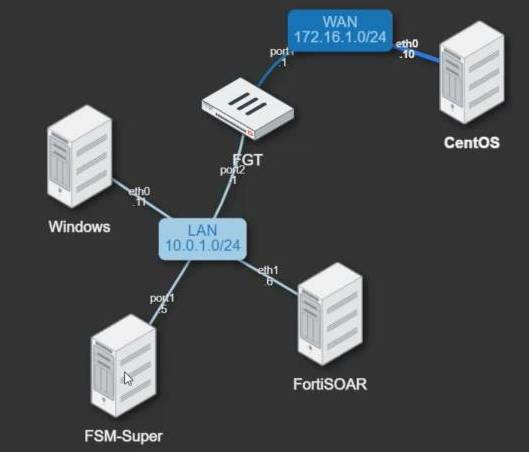

# Stolen Credential Leading to Data Exfiltration  Solution Pack

## Overview

### Introduction

This article describes the “Stolen Credential Leading to Data Exfiltration” Solutions Pack. The solution pack demonstrates the scenarios and use cases around Malware.
The below scenario demonstrates and generates a demo alert for the Alert.

- An attacker gains access to the Firewall using a leaked credential.
- The attacker then modifies the firewall configuration to allow RDP Access and laterally moves to a windows box.
- Creates a new domain account as a backdoor for subsequent access and also exfiltrates data.
- Observe the following in this scenario:
  - **Password Changed Alert:** Select the password change alert (typically assumed to be benign), but in this case, the collaboration panel has multiple comments indicating the indicator (jack and 10.0.1.11)
  - **Recommendations Panel:** Open the Recommendation Panel, and observe that there are alerts such as firewall configuration change suggested as related to this alert (thats because of common indicators).
  - **Escalate to Incident:** Select all suggested alerts and Escalate them to Incident. Observe Incident's correlation graph, and how it further shows Outbound data transfer as well
  

### Usage

More information about usage of the Stolen Credential Leading to Data Exfiltration  Solution Pack [here](https://github.com/fortinet-fortisoar/solution-pack-stolen-credential-leading-to-data-exfiltration/blob/develop/docs/solution-pack-guide.md).

## Version Information

- Solution Pack Version: 1.0.0
- FortiSOAR™ Version Tested on: 7.2.0
- Authored By: Fortinet
- Certified: No

## Prerequisite

Ensure that the below solution packs are deployed:

**Solution Pack**|**Purpose**|**Doc Link**|
| :- | :- | :- |
|SOAR Framework 1.0.0|Require for Incident Response modules and Action playbooks|[Click here](https://github.com/fortinet-fortisoar/solution-pack-soar-framework/blob/develop/README.md)|
|SOC Simulator 1.0.1|Require for Scenario Module and SOC Simulator connector| [Click here](https://github.com/fortinet-fortisoar/solution-pack-soc-simulator/blob/develop/README.md)|

## Contents

1. Connectors

**Solution Pack**|**Purpose**|**Doc Link**|
| :- | :- | :- |
|Active Directory|2.2.0|[Click Here](https://docs.fortinet.com/document/fortisoar/2.2.0/active-directory/154/active-directory-v2-2-0)|
|IPFortinet FortiSIEMStack|4.3.0|[Click Here](https://docs.fortinet.com/document/fortisoar/4.3.0/fortinet-fortisiem/187/fortinet-fortisiem-v4-3-0)|

**Warning:** After deployment, this Solution Pack will install or upgrade the existing connectors, mentioned above.

2. Playbook Collection(s)

    - 02 - Use Case - Stolen Credential Leading to Data Exfiltration:
Following is a list of playbooks under “02 - Use Case - Stolen Credential Leading to Data Exfiltration”

    **Playbook Name**|**Description**
    | :- | :- |
    |Generate Alert for Exfiltration(File Transfer)|Generates alert from FortiSIEM incident where an attacker performes outbound file transfer.|
    |Generate Alert for Firewall Configuration Change(Policy Change)|Generates alert from FortiSIEM incident where an attacker gains initial access to the network and make firewall configuration change by changing firewall policy|
    |Generate Alert for Firewall Configuration Change(Port Forwarding)|Generates alert from FortiSIEM incident where an attacker gains initial access to the network and make firewall configuration change by performing port forwarding|
    |Generate Alert for Persistence(Domain User Created)|Generates alert from FortiSIEM incident where an attacker once gains access to the network and creates a domain user.|
    |Generate Alert for Persistence(Schedule Task)|Generates alert from FortiSIEM incident where an attacker creates Windows scheduled task.|
    |Generate Alert for Persistence(User Added to Administrator Group)|Generates alert from FortiSIEM incident where the user is added to the Windows Administrator Group.|
    |Generate Alert for Persistence(User Password Reset)|Generates alert from FortiSIEM incident where user created by attacker changes the administrator user password.|

