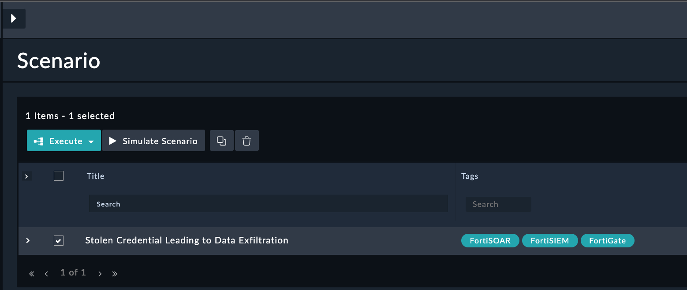
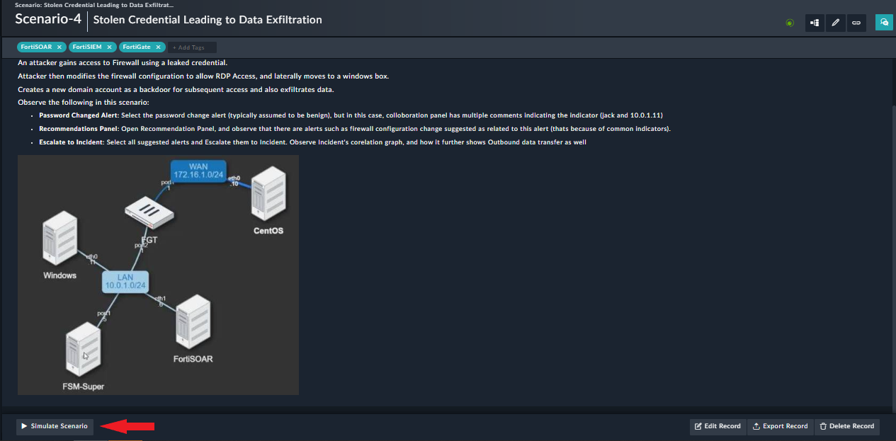
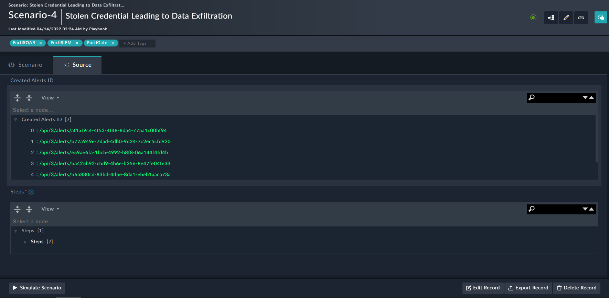

# Usage of Stolen Credential Leading to Data Exfiltration Solution Pack

## Use Case Workflow

This solution pack contains a Scenario-based workflow

### 1. Scenario-based Workflow

The scenario demonstrates and generates a demo alert for the Alert Type

- Firewall Configuration Change
- Domain User Created
- User Group Changed
- Schedule Task Created
- Data Exfiltration
- Password Reset

Refer to the below step to execute the scenarios:

1. Go to the `Simulations` menu in Navigation and choose Device `Stolen Credential Leading to Data Exfiltration` scenario

2. Open a `Stolen Credential Leading to Data Exfiltration` scenario and Click on the `Simulate Scenario` button

3. Demo record will be created for the scenario

4. The created Alerts records IRI will be displayed in the Scenario record

